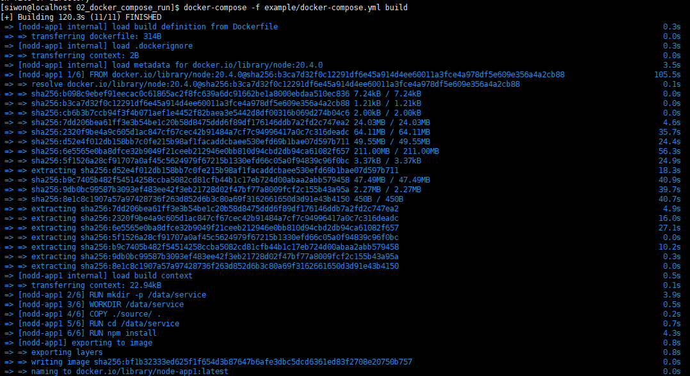
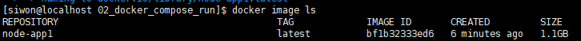
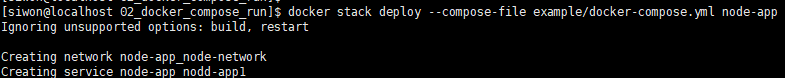
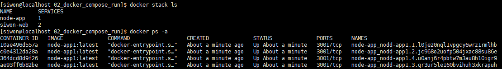
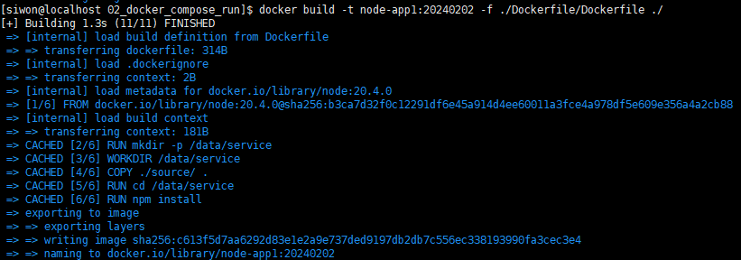
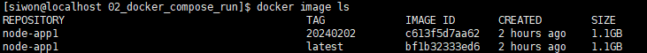
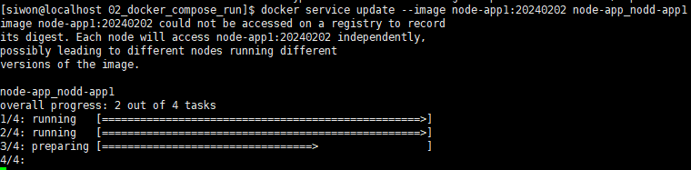
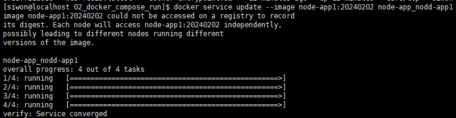
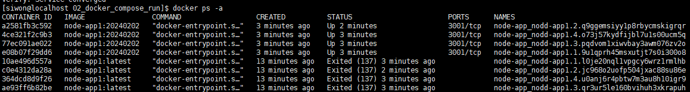
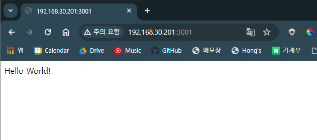

# Docker Compose 사용하여 이미지 생성

## docker-compose yml 실행 명령어
```bash
$ docker-compose [옵션] [명령어]

$ docker-compose -f docker-compose.yml build
```

## yml 작성 
[docker-compose.yml](./example/docker-compose.yml)
``` yml
version: '3.7' // yml 버전

services: // 서비스 정의
  nodd-app1: // 서비스명
    image: node-app1:latest // 서비스 이미지
    build: // 빌드 설정
      context: ./../ // Dockerfile 이 있는 경로 ( 절대경로 또는 실행하는 위치로 부터 상대 경로 )
      dockerfile: ./Dockerfile/Dockerfile // 빌드될 Dockerfile 경로 파일명이 Dockerfile 이 아닐경우 파일명 기입
    ports: // 포트 설정
      - "3001:3001"
    deploy: // 배포시 컨테이너 환경 설정
      replicas: 4 // 리플리케이션 수
      resources: // 컨테이너 별 리소스 조정
        limits: // 최대치 제한
          cpus: '0.25' // cpu
          memory: 256M // 메모리
        reservations:  // 최소 기본치 할당
          memory: 256M
    restart: always // 컨테이너 다운시 재시작 관련 설정
    networks: // 연결 네트워크
      - node-network
    logging: // 로거 관련 설정
      #limit logs to 150MB (3rotations of 50M each)
      driver: "json-file" // 로그파일 형태
      options: // 옵션
        max-size: "50m"
        max-file: "3"
        
networks: // swaram 구성시 설정할 네트워크
  node-network:
```

## 이미지 빌드
- 이미지 빌드
``` bash
// stack 전체 빌드이기에 yml 로 지정 단일 서비스 일땐 서비스 dockerfile 지정
$ docker-compose -f example/docker-compose.yml build
```
<br />
- 빌드 완료후 이미지 확인
```bash
$ docker image ls
```

- 이미지 배포
```bash
// docker stack deploy --compose-file {compose.yml 파일 경로} {stack 명칭}
$ docker stack deploy --compose-file example/docker-compose.yml node-app
```

- 이미지 배포 확인
```bash
// stack 확인
$ docker stack ls
// 컨테이너 확인
$ docker ps -a
```

- 서비스 단위 빌드
```bash
// docker build -t {image명}:{태그} -f {Dockerfile 경로} {context 경로}
$ docker build -t node-app1:20240202 -f ./Dockerfile/Dockerfile ./
```

- 서비스 단일 이미지 빌드 확인
```bash
$ docker image ls
```

위의 내역으로 볼 수 있듯이 TAG 에 신규 태그에 이미지가 하나더 생성된 것이 확인
- 서비스 단위 업데이트(배포)
```bash
// docker service update --image {이미지:태그명} {컨테이너 서비스명}
$ docker service update --image node-app1:20240202 node-app_nodd-app1
```


- 완료된 후 기존 컨테이너 태그 서비스들은 종료되고 신규 태그의 서비스들만 올라간것을 확인
- docker 특성상 설정값을 주지 않으면 과거 컨테이너는 계속 살아있길래 배포 후 이상이 없을시에는 구 컨테이너 정리 필요



접근포트로 사이트 접속시 뜨는 화면

## 과제1
- service 2개의 한개의 stack을 배포 및 업데이트 관련 스크립트 작성
    - stack
        - stack_name : test-stack
        - service 1 : 
            - service_name : test-app1 
            - port : 3001:3001
            - replicas : 2
            - resources : 
                memory : 128MB
                cpu : 0.25
        - service 2 : 
            - service_name : test-app2
            - port : 3002:3002
            - replicas : 4
            - resources : 
                memory : 64MB
                cpu : 0.25
    - 위 조건에 해당하는 yml 작성
    - dockerfile 형태 및 관련 소스는 자유
    - stack과 service 빌드&배포 스크립트 작성
        - sh 파일 또는 txt 파일로 작성